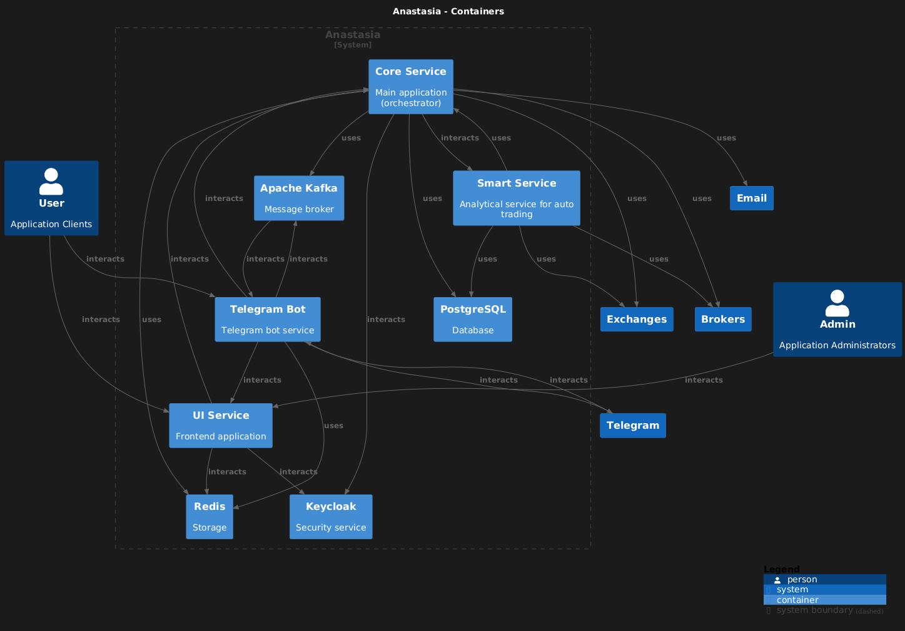
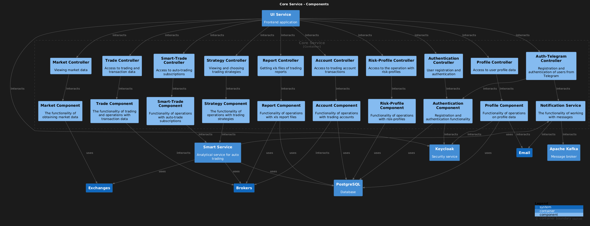
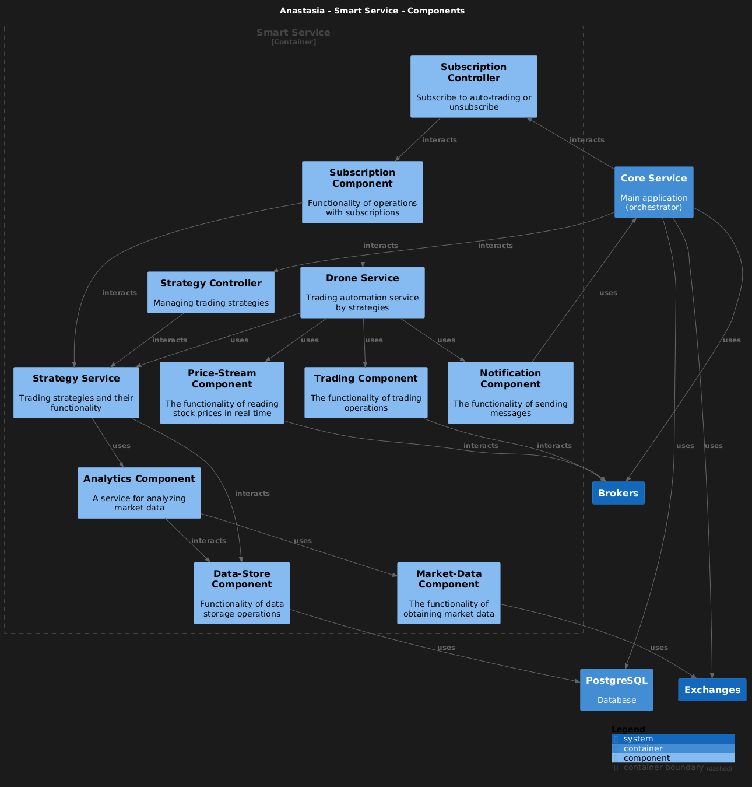
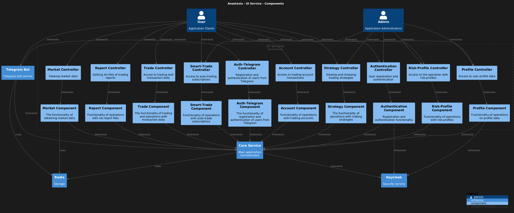
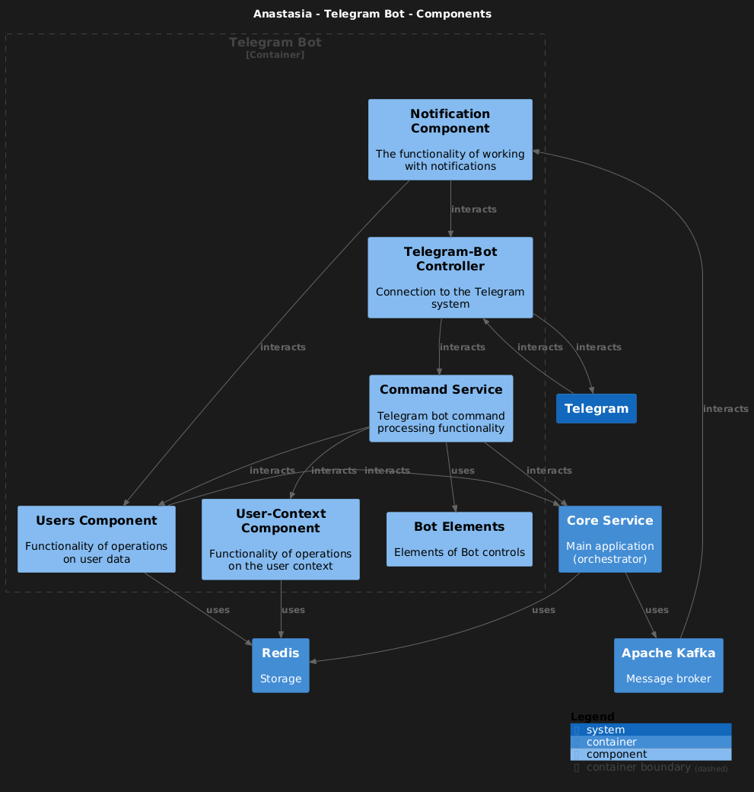

[RU](readme_RU.md)

# TRADER PROJECT

## The exchange trading service that provides support for automated transactions based on trading strategies.
### Service features:
- Connection of brokerage accounts by API keys
- Access to a variety of stock quotes
- Ability to execute trades manually
- Subscription to automatic trading strategies
- Setting up a custom risk profile or choosing from the defaults
- Trading history access in XLSX files
- Management via Telegram bot
***
## Technology stack:
+ #### Java 21
+ #### Spring Framework
+ #### Gradle
+ #### Postgresql
+ #### Redis
+ #### Kafka
+ #### Keycloak
+ #### Docker
***

## Project structure:
### The components of the project is 4 main applications (so-called microservices):
***
+ ### Core Service:
+ The main application of the project. There is orchestrator between the other components.
  Performs the basic logic of the service, except market analytics and trading automation.
  The main tasks -
  service administration,
  user authentication,
  user data management,
  access to market data,
  execution of trade transactions,
  saving trade history in xlsx files,
  sending notifications about transactions.
  Technologies used:
  + Spring Boot 3
      + WebFlux
      + Web Security OAuth2
      + Data R2DBC
      + Data Redis Reactive
  + Flyway migration
  + Postgresql database
  + Apache Kafka
  + gRPC Framework
  + Apache POI API
  + Redis storage
  + Keycloak
***
+ ### Smart Service:
+ The application for analytics and automated trading.
  There is responsible for market analysis, identifying potential opportunities, and storing analytical data.
  It also enables the trading of financial instruments based on predefined strategies.
  Technologies used:
  + Spring Boot 3
  + Spring gRPC starter
  + gRPC Framework
  + Postgresql database
***
+ ### Telegram Bot:
+ The telegram bot application. Provides easy service management.
  Technologies used:
  + Spring Boot 3
  + Telegram bots 6
  + Redis storage
  + Apache Kafka
***
+ ### Notification Service:
+ The application responsible for sending notifications to users.
  Technologies used:
  + Spring Boot 3
  + Flyway migration
  + Postgresql database
  + Spring Mail
  + Apache Kafka
***
***
+ ### UI Service
+ The frontend application for browser access.
  There has a simple interface and functionality.
  Technologies used:
  + Spring Boot 3
    + WebMVC
    + Web Security OAuth2
    + Thymeleaf
    + Data Redis
  + Keycloak
  + Redis storage
***

## Project structure

### Applications context

### Core Service

### Smart Service

### UI Service

### Telegram Bot

***
 
//TODO
